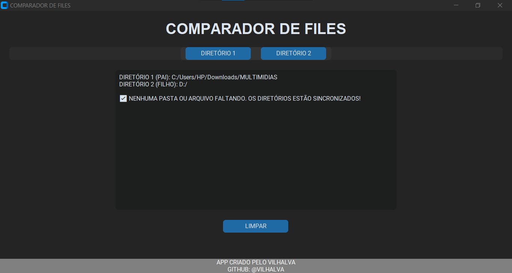

# COMPARADOR DE FILES
👨‍🏫ESTE PROGRAMA PERMITE AO USUÁRIO SELECIONAR DUAS PASTAS E VERIFICAR SE TODAS AS SUBPASTAS DO DIRETÓRIO 1 (PAI) TAMBÉM EXISTEM NO DIRETÓRIO 2 (FILHO), EXIBINDO NA TELA QUAIS ESTÃO FALTANDO.

 <br>

## DESCRIÇÃO:
Esse é um **aplicativo gráfico em Python**, feito com a biblioteca `customtkinter`, que permite **comparar a estrutura de pastas entre dois diretórios** (chamados de `DIRETÓRIO 1 (PAI)` e `DIRETÓRIO 2 (FILHO)`). 

Este programa permite ao usuário:

1. Escolher duas pastas.
2. Verificar se todas as subpastas do **Diretório 1 (PAI)** também existem no **Diretório 2 (FILHO)**.
3. Ver na tela quais subpastas estão faltando no segundo diretório.

## FUNCIONALIDADES:
1. `selecionar_diretorio1` e `selecionar_diretorio2:`
    * Abrem janelas para o usuário selecionar dois diretórios.
    * Mostram os caminhos escolhidos na `result_box`.
    * Após a seleção, chamam a função de comparação.

2. `listar_subpastas(raiz):`
    * Usa `os.walk` para percorrer todas as subpastas do diretório.
    * Retorna um conjunto de caminhos **relativos** das subpastas (padronizados com `/`).

3. `comparar_pastas:`
    * Compara as subpastas dos dois diretórios.
    * Mostra na `result_box` as pastas que **existem no Diretório 1 mas faltam no Diretório 2**.
    * Se não houver diferença, avisa que as estruturas estão sincronizadas.

## POR QUE CRIEI ESTE APP?
O principal motivo foi garantir que todos os diretórios e arquivos presentes no meu **Desktop** estivessem devidamente **sincronizados com meus pendrives**. Com ele, consigo identificar rapidamente se há algo faltando — seja uma pasta inteira ou apenas um arquivo — e até mesmo detectar **nomes divergentes** entre os diretórios.

Este app foi criado **às pressas**, mas já me **salvou de inúmeros problemas com backups**, evitando perda de dados importantes por falta de organização ou cópias incompletas.

## COMO USAR?
1. **Instale as bibliotecas necessárias:** Antes de executar o app, certifique-se de instalar todas as dependências necessárias. No terminal, execute o seguinte comando para instalar as dependências listadas no arquivo requirements.txt em `CODIGO`:
   ```bash
   pip install -r requirements.txt
   ```

2. **Executar o APP:**
   * No diretório `./CODIGO`, execute o aplicativo com o comando:

   ```bash
   python CODIGO.py
   ```

    * Ao rodar, a janela com o título **“COMPARADOR”** será exibida.

3. **Selecionar o Diretório 1 (PAI):**
   * Clique no botão **“DIRETORIO 1”**.
   * Escolha a pasta principal que você deseja comparar (geralmente a mais completa ou original).
   * O caminho selecionado aparecerá na caixa de texto (`result_box`).

4. **Selecionar o Diretório 2 (FILHO):**
   * Clique no botão **“DIRETORIO 2”**.
   * Escolha a segunda pasta que você deseja comparar com a primeira (geralmente uma cópia ou estrutura de destino).
   * O caminho também será exibido na caixa de texto.

5. **Resultado da Comparação:**
   * Assim que **ambos os diretórios forem selecionados**, o app realiza a comparação automaticamente.
   * Ele mostra na tela:
     * ✅ Se **todas as pastas e arquivos estiverem presentes no Diretório 2**.
     * ❌ Se houver **pastas/subpastas faltando** ou **arquivos ausentes** no Diretório 2.
   * A saída é organizada e fácil de ler, destacando:
     * Pastas faltando 📁
     * Arquivos faltando 📄

7. **Exemplo de Saída:**
   ```text
   DIRETÓRIO 1 (PAI): C:/Projetos/Main
   DIRETÓRIO 2 (FILHO): C:/Projetos/Copia

   📁 PASTAS/SUBPASTAS FALTANDO NO DIRETÓRIO 2:

   - modulo1/
   - modulo1/submoduloA/
   - utils/tools/

   📄 ARQUIVOS FALTANDO NO DIRETÓRIO 2:

   - modulo1/main.py
   - modulo1/submoduloA/config.yaml
   - README.md
   ```

8. **Botão "LIMPAR":**
   * Após uma verificação, você pode clicar em **“LIMPAR”** para limpar todos os resultados exibidos e fazer uma nova comparação.

## SOBRE O EXECUTAVEL E O INSTALADOR:
### 1. EXECUTANDO:
   * O instalador está disponível  em `./APP`. Para instala-lo, basta dar dois cliques e seguir as orientações na tela. 

### 2. GERANDO O EXECUTAVEL:
   **1. Instalação do PyInstaller:**
   * Certifique-se de ter o PyInstaller instalado. Se não tiver, instale usando o comando abaixo:
   ```bash
   pip install pyinstaller
   ```

   **2. Gerando o Executável:**
   * No diretório `./CODIGO`, utilize o comando abaixo para gerar o executável:

   ```bash
   pyinstaller EXECUTAVEL.spec
   ```

   * O executável `COMPARADOR DE FILES.exe` será criado na pasta `./CODIGO/dist`.
   * Após a geração, você pode excluir a pasta `./CODIGO/build`.

### 3. GERANDO O INSTALADOR:
#### PASSO 1: BAIXAR E INSTALAR O INNO SETUP:
1. **Download**: Baixe o Inno Setup do site oficial: [Inno Setup](http://www.jrsoftware.org/isdl.php).
2. **Instalação**: Siga o assistente de instalação para instalar o Inno Setup no seu sistema.

#### PASSO 2: CRIAR O INSTALADOR:
1. **Editar o arquivo do instalador**
   No diretório `./CODIGO`, abra o arquivo `INSTALADOR.iss` e atualize os seguintes trechos:

   * **Ícone do instalador:**
     Substitua o caminho atual da linha `SetupIconFile=` pelo caminho correto do seu ícone:

     ```ini
     SetupIconFile=C:\Users\HP\Downloads\GITHUB\REPOSITORIO\02-PROJETOS PUBLICOS\02-APLICATIVOS\COMPARADOR DE FILES\CODIGO\imagem.ico
     ```

   * **Caminho do executável a ser empacotado:**
     Atualize a seção `[Files]` com o caminho do executável gerado:

     ```ini
     [Files]
     Source: "C:\Users\HP\Downloads\GITHUB\REPOSITORIO\02-PROJETOS PUBLICOS\02-APLICATIVOS\COMPARADOR DE FILES\CODIGO\dist\{#MyAppExeName}"; DestDir: "{app}"; Flags: ignoreversion
     ```

2. **Gerar o instalador no Inno Setup:**
   * Abra o arquivo `./CODIGO/INSTALADOR.iss` com o **Inno Setup**.
   * Clique em **"Compile"** para gerar o instalador.

3. **Limpar arquivos temporários:**
   * Após a criação do instalador, você pode excluir o executável temporário:

     ```
     ./CODIGO/dist/COMPARADOR DE FILES.exe
     ```

4. **Instalando o Aplicativo:**
   * Execute o instalador gerado, localizado em:

   ```
   ./APP/COMPARADOR DE FILES.exe
   ```

   * O assistente de instalação será iniciado e, por padrão, o aplicativo será instalado em:

   ```
   C:\Program Files\COMPARADOR DE FILES
   ```

## SUBSÍDIOS:
* [DOCUMENTAÇÃO OFICIAL DO PYINSTALLER](https://pyinstaller.org/en/stable/)
* [DOCUMENTAÇÃO OFICIAL DO INNO SETUP](http://www.jrsoftware.org/isinfo.php)

## NÃO SABE?
- Entendemos que para manipular arquivos em muitas linguagens, é necessário possuir conhecimento nessas áreas. Para auxiliar nesse aprendizado, oferecemos cursos gratuitos disponíveis:
* [CURSO DE PYTHON](https://github.com/VILHALVA/CURSO-DE-PYTHON)
* [CURSO DE CUSTOMTKINTER](https://github.com/VILHALVA/CURSO-DE-CUSTOMTKINTER)
* [CONFIRA MAIS CURSOS](https://github.com/VILHALVA?tab=repositories&q=+topic:CURSO)

## CREDITOS:
- [PROJETO CRIADO PELO VILHALVA](https://github.com/VILHALVA)
